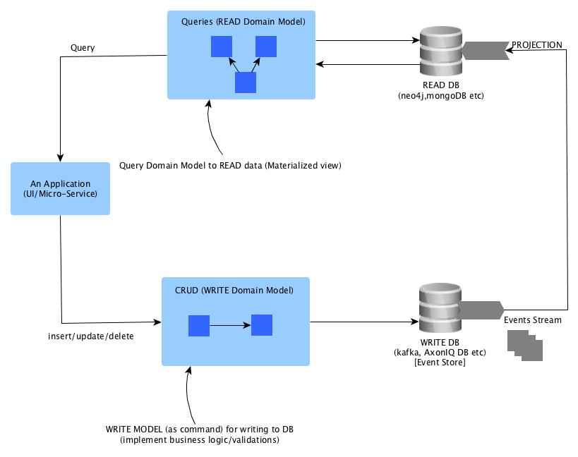
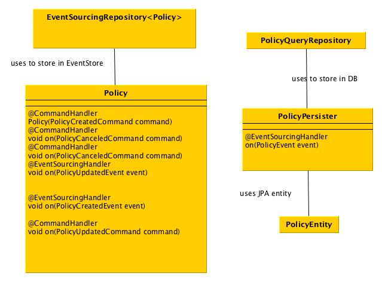
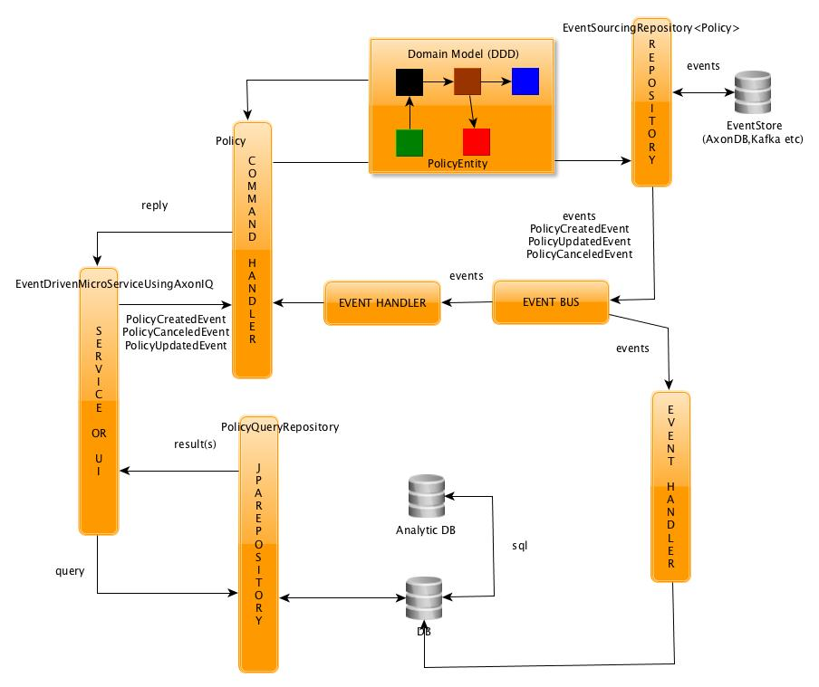
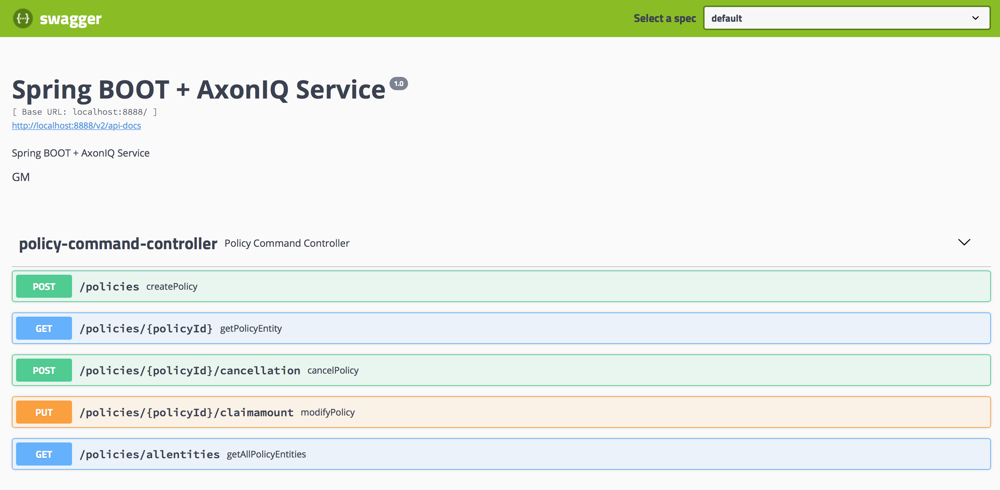

##  Command Query Responsibility Segregation (CQRS) Using Event Driven Architecture (EDA) With Spring BOOT + AxonIQ + Async JPA Persistence


### Overview
The starting point of **CQRS** design pattern is the notion of _differentiating between READ and WRITE model_. 
This design pattern professes if the QUERY capabilities of an application is very different or complex or may be, 
relational DB are not apt for querying (scalable), it's better to separate/segregate  **query model** from **write model.**

The corner stone in implementing CQRS is **Event Driven Architecture**. In simple terminology, in event driven architecture,
modules interact with each other using EVENT and each module are independent & not aware of each other. The module 
enroll/subscribe to event & take actions. This enable use to cut the module dependencies (in pom.xml) and ease out 
creation of micro-services.

The following picture shows CQRS design pattern build using event driven architecture:



_**NOTE: Key Concepts Normally Mixed  Up**_
1. If QUERY model is not complex, do not go in the direction of CQRS
2. EVENT != MESSAGE
3. Event Driven != CQRS
4. Event is never physically deleted i.e. delete is an another event. This aides in ML and AI

### Monolith And Micro-Services And Role EDA Using AxonIQ
In my opinion a monolithic application can be split into micro-services based architecture in following steps:

**Step 1.** Implement Modularization i.e. create modules, each module is dedicated to perform single functional responsibility
   (also termed implementation of separation of concerns)

**Step 2.** Cut Module inter-dependencies

The **Step 2** is very important and is the make or break situation in the endeavour to rollout micro-services based architecture.
Event Driven architecture style plays very important part in implementing **Step 2.** AxonIQ is a nice framework to implement 
Event Driven programing model in a Domain Driven Design way. Using AxonIQ it's possible to work with root aggregator domain
entity (Policy)

EventDrivenMicroServiceUsingAxonIQ mico-serivce is Policy application with:
1. Separate WRITE model
2. Separate READ model
3. Events are stored in embedded AxonIQDB  (using async JPA)
4. READ is performed using JPA [using jpa-eclipselink](https://github.com/mgorav/jpa-eclipselink) + Derby
5. Inter module interaction can be in JVM interaction or over http or WebSocken etc. AxonIQ routes an event to an Event Bus (which
can be AxonIQDB or Kafka or [pumpkin db](http://pumpkindb.org)). The subscriber of an event can either go over http (or
an other protocol) to action on the event request.
6. Clear separation of domain object from entity (Policy is domain object & PolicyEntity is an entity - see class diagram below)

NOTE: 
1) In above programming style, write needs to fast & asynchronous. JPA vendor does not provide async persistence but 
[using jpa-eclipselink](https://github.com/mgorav/jpa-eclipselink) this can be achieved.
2) Domain model is not anemic and also there is a clear separation of domain API from entity (persistence mechanism), 
they are not tightly coupled. This is of great help in creating modularization.

Below is the domain of of  EventDrivenMicroServiceUsingAxonIQ:
      
 
 The following picture shows EventDrivenMicroServiceUsingAxonIQ from AxonIQ framework prospective:
 


### Instructions to setup and run EventDrivenMicroServiceUsingAxonIQ
1. Download & setup jpa-eclipse for async persistence in local maven repo
````
    git clone git@github.com:mgorav/jpa-eclipselink.git
    cd jpa-ecliselink
    mvn clean install -DskipTests
````

2. Download & setup EventDrivenMicroServiceUsingAxonIQ

````
    git clone git@github.com:mgorav/EvendDrivenMicroServiceUsingAxonIQ.git
    cd EvendDrivenMicroServiceUsingAxonIQ
    mvn clean install -DskipTests
````

3. Run EventDrivenMicroServiceUsingAxonIQ 

````
    java -jar target/EvendDrivenMicroServiceUsingAxonIQ-0.0.1-SNAPSHOT.jar
    
````

This will run the application on the port 8888. All the APIs exposed can be accessed by open the swagger ui as shown below:

````
    http://localhost:8888/swagger-ui.html
    
````

 
 
 
 ### Conclusion
 In compositional micro-services based architecture, **think EVENT based inter module interactions.** This make each micro-service 
 independent of each other. This helps in rolling out new functionality as micro-service fast. Also this architecture & programing style aides
 in building serverless micro-services or function as service. At the end it's all about how business functionality can be taken to production 
 as fast as possible.
 
 
